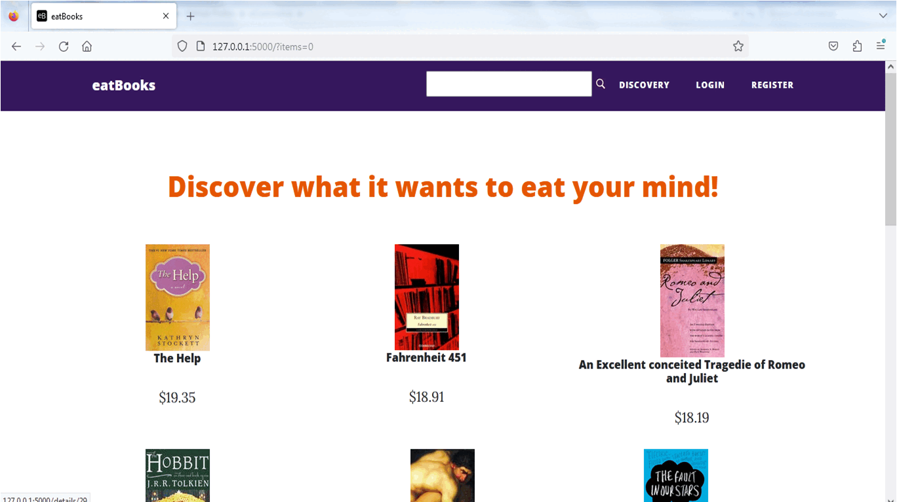

# An eCommerce Website
##A website to feed your mind: eatBooks

##bookstore eCommerce website, Pick your favorite book!

## Features

- Account
- Bag
- Search by category
- Checkout (Stripe)

# eatBooks eCommerce Website Preview

<h2>
  
</h2>

## Future work

- Payment integration with PayPal
- delivery options
- Show user Profile 